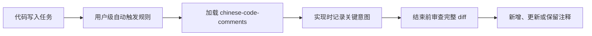

# Chinese Code Comments

为代码 Agent 自动生成、更新和审查规范、简洁、清晰的代码注释。

本项目只解决代码注释问题。它适用于前端、后端、C/C++、脚本、测试、SQL 和基础设施代码，不扩展到调试、代码评审、技术写作或其他独立能力。

## 目录

- [快速开始](#快速开始)
- [使用方式](#使用方式)
- [核心行为](#核心行为)
- [注释模式](#注释模式)
- [支持的 Agent 与安装路径](#支持的-agent-与安装路径)
- [安装、升级、诊断与卸载](#安装升级诊断与卸载)
- [文件安全](#文件安全)
- [项目验证](#项目验证)
- [故障排查](#故障排查)
- [项目结构](#项目结构)
- [边界与限制](#边界与限制)
- [贡献](#贡献)
- [许可证](#许可证)

## 快速开始

### 前置条件

- Node.js 22+。
- Windows、macOS 或 Linux。
- 实际使用某个 Agent 时，需要安装并登录对应的 Agent CLI。

### 完整安装：Skill 和自动触发规则

运行 GitHub `npx` 完整安装器：

```bash
npx --yes github:xuanjinchen/chinese-code-comments install
```

未指定 `--agent` 时，安装器默认配置全部六个正式支持的 Agent：Codex、Claude Code、Google Gemini CLI、xAI Grok CLI、OpenCode 和 Nous Research Hermes。

完整安装器会安装 Skill，并向每个 Agent 的用户级规则文件写入受管策略。新建 Agent 任务后，代码写入请求即使没有提到“注释”，也会进入两阶段注释审查。

### 标准安装：仅安装 Skill

也可以使用 Agent Skills 标准入口：

```bash
npx skills add xuanjinchen/chinese-code-comments -g --all
```

两个入口的能力不同：

| 入口 | 安装 Skill | 安装全局自动触发规则 | 提供 `install` / `uninstall` / `doctor` |
| --- | --- | --- | --- |
| GitHub `npx` 完整安装器 | 是 | 是 | 是 |
| `npx skills add` 标准入口 | 是 | 否 | 否 |

**标准 Skills 入口不会安装自动触发规则。只有完整 GitHub `npx` 入口会安装六个 Agent 的全局自动触发规则。** 如果需要在未显式要求注释时自动执行完整审查，请使用完整安装器。

不要同时用两个入口管理同一份 `chinese-code-comments` 副本。来源或所有权不一致时，完整安装器的 `doctor` 会报告漂移，但不会静默删除其他工具管理的文件。

## 使用方式

最常见的请求不需要提到注释：

```text
修复 PaymentService.java 的并发重复扣款问题，并运行相关测试。
```

完整安装后，目标 Agent 会在实现过程中记录有维护价值的关键意图，并在结束前加载 `chinese-code-comments` 审查完整 diff 和未跟踪交付文件。只有确实存在维护价值时才新增或更新注释；代码已经足够清晰时，可以得出“不需要新增注释”的结论。

也可以明确指定语言或粒度：

| 用户请求 | 模式与语言 | 预期结果 |
| --- | --- | --- |
| `修复缓存击穿问题` | `SCOPED`，默认中文 | 只在并发控制或失效边界附近添加必要注释。 |
| `给这段 Python 代码逐行注释` | `GROUPED`，默认中文 | 连续且语义一致的语句共用一条注释。 |
| `每一行都必须写英文注释` | `STRICT`，英文 | 每条可执行语句分别使用英文注释。 |
| `给新增方法写日文方法注释` | `SCOPED`，日文，方法级 | 使用目标语言惯用的文档注释格式。 |
| `更新已经失真的英文注释` | `SCOPED` | 只更新失真的注释，保留其他准确注释。 |
| `修改 settings.json` | `SCOPED` | 不向标准 JSON 插入注释。 |

## 核心行为

| 维度 | 行为 |
| --- | --- |
| 自动触发 | 完整安装器写入的用户级策略要求所有代码写入任务执行两阶段注释审查。 |
| 默认语言 | 默认使用简体中文；优先级是“用户指定语言、项目就近规范、简体中文”。 |
| 默认内容 | 只解释业务意图、约束、边界、异常、并发、资源管理、兼容性和非直观实现。 |
| 现有注释 | 保留准确的现有注释及其语言；只更新失真、错误或与代码改动冲突的注释。 |
| 注释密度 | 默认不逐句翻译赋值、循环、函数调用或其他自解释代码。 |
| 完整审查 | 实现结束前检查完整 diff 和未跟踪交付文件，不只检查新增代码行。 |
| 无需注释 | 允许不新增注释，但最终回复仍须说明已完成注释审查。 |
| 不支持注释的格式 | 不向标准 JSON、锁文件、生成代码、第三方依赖或其他不支持注释的格式写入非法内容。 |

自动触发由两层机制共同完成：

1. `SKILL.md` 定义注释语言、模式、质量标准和两阶段工作流。
2. Agent 对应的用户级规则文件要求代码写入任务加载该 Skill。



仅安装标准 Skill 入口可以让支持 Agent Skills 的工具发现 `SKILL.md`，但不会建立第二层全局自动触发规则。

## 注释模式

Skill 会在编辑前锁定本次模式，结束前按同一模式复核。

| 模式 | 触发条件 | 行为 |
| --- | --- | --- |
| `SCOPED` | 默认模式，或用户指定方法、类、API、代码块、关注点等范围 | 只添加与目标范围相关的高价值注释。 |
| `GROUPED` | 用户正向要求“逐行注释”“line-by-line comments”“一行ずつコメント”等，但没有要求每一行都必须单独注释 | 按连续语义块组织注释，避免一行一注。 |
| `STRICT` | 用户明确要求“每行都要”“一行一注”“每条可执行语句都必须注释”或其他语言的等价全称约束 | 为每条可执行语句分别注释，同时保持代码可编译、可解析和可格式化。 |

“添加必要注释”“不要逐行注释”“并非每条语句都必须注释”都保持 `SCOPED`。用户还可以指定代码块、函数、类、API、参数、返回值、异常或其他注释基准。

## 支持的 Agent 与安装路径

### 正式支持范围

| Agent | `--agent` ID | 默认 Skill 存储组 | 默认全局自动触发规则 | 配置根覆盖变量 |
| --- | --- | --- | --- | --- |
| Codex | `codex` | `agents` | `~/.codex/AGENTS.md` | `CODEX_HOME` |
| Claude Code | `claude` | `claude` | `~/.claude/CLAUDE.md` | `CLAUDE_CONFIG_DIR` |
| Google Gemini CLI | `gemini` | `agents` | `~/.gemini/GEMINI.md` | `GEMINI_CLI_HOME` |
| xAI Grok CLI | `grok` | `agents` | `~/.grok/AGENTS.md` | `GROK_HOME` |
| OpenCode | `opencode` | `agents` | `~/.config/opencode/AGENTS.md` | `XDG_CONFIG_HOME` |
| Nous Research Hermes | `hermes` | `hermes` | `~/.hermes/SOUL.md` | `HERMES_HOME` |

`~` 表示当前用户主目录。安装器会按 Windows、macOS 或 Linux 的本机路径规则解析这些位置。配置根环境变量只覆盖对应 Agent 的配置根；共享的 `agents` Skill 位置仍是 `~/.agents/skills/`。

### 三个 Skill 副本

默认全量安装只保留三个必要副本，不使用符号链接：

| 存储组 | 默认目录 | 使用者 |
| --- | --- | --- |
| `agents` | `~/.agents/skills/chinese-code-comments/` | Codex、Gemini、Grok、OpenCode |
| `claude` | `~/.claude/skills/chinese-code-comments/` | Claude Code |
| `hermes` | `~/.hermes/skills/chinese-code-comments/` | Hermes |

`agents` 副本还包含 Codex 所需的 `agents/openai.yaml`。局部卸载共享该副本的某个 Agent 时，只要其他已安装 Agent 仍在引用该存储组，副本就会保留。

### Hermes 的可见标记

Hermes 会扫描隐藏 HTML 注释，因此安装器在 `~/.hermes/SOUL.md` 中使用可见 Markdown 标记：

```markdown
## chinese-code-comments managed policy: start
...
## chinese-code-comments managed policy: end
```

该区块只约束代码注释行为，不写入身份、人格或其他会话行为。其他五个 Agent 使用唯一的 HTML 受管标记。

## 安装、升级、诊断与卸载

### 选择 Agent

`install`、`uninstall` 和 `doctor` 不带 `--agent` 时默认处理全部六个 Agent。`--agent` 接受逗号分隔值，也可以重复传入：

```bash
npx --yes github:xuanjinchen/chinese-code-comments install --agent codex
npx --yes github:xuanjinchen/chinese-code-comments install --agent codex,gemini --agent hermes
```

安装器允许在对应 Agent CLI 尚未安装时预先创建配置。请使用表格中的规范 ID；未知或空 ID 会在写文件前失败，重复 ID 会被确定性去重。

### 升级

`install` 同时负责首次安装和幂等升级。再次运行相同命令即可更新已选 Agent：

```bash
npx --yes github:xuanjinchen/chinese-code-comments install
npx --yes github:xuanjinchen/chinese-code-comments install --agent claude
```

更新后新建 Agent 任务，使新的 Skill 和全局规则生效。

### 诊断

`doctor` 是只读检查。它会核对 Skill 内容、全局受管区块、安装状态和共享存储组引用，并报告对应 CLI 是否在 `PATH` 中：

```bash
npx --yes github:xuanjinchen/chinese-code-comments doctor
npx --yes github:xuanjinchen/chinese-code-comments doctor --agent codex
```

CLI 缺失只作为信息展示，不会使已经正确写入的配置失效。Skill、策略或状态不一致时，`doctor` 返回非零退出码。

### 卸载

只卸载指定 Agent：

```bash
npx --yes github:xuanjinchen/chinese-code-comments uninstall --agent codex
```

卸载全部六个 Agent：

```bash
npx --yes github:xuanjinchen/chinese-code-comments uninstall
```

卸载器只删除本项目托管的 Skill 文件、状态条目和全局规则区块。规则文件和 Skill 目录中的非托管内容会保留；重复卸载成功返回。

## 文件安全

- 安装和卸载先预检全部目标，再暂存并提交。可捕获的提交失败会按相反顺序恢复已经提交的目标。
- 状态保存在 `~/.chinese-code-comments/state.json`，用于跟踪已安装 Agent 和共享 Skill 引用。
- 现有规则文件的 UTF-8 BOM、主换行风格、末尾换行和受管区块外文本保持不变。
- 新文件使用 UTF-8 无 BOM 和 LF。安装器拒绝 UTF-16、NUL、无效 UTF-8、重复标记和残缺标记。
- 提交后的临时文件清理失败只产生 warning，并保留恢复证据，不把已经成功的安装误报为失败。

## 项目验证

以下命令面向仓库维护者。它们要求 Node.js 22+，可在 Windows、macOS 和 Linux 上运行。

### 确定性检查

```bash
npm test
npm run validate
npm run check
npm pack --dry-run
```

- `npm test` 运行 Node 内置测试，覆盖 Skill 契约、六个适配器、安装生命周期、编码与事务，以及行为 grader。
- `npm run validate` 检查包元数据、CLI、Skill 结构、README 命令和仓库文件。
- `npm run check` 顺序运行全部不调用外部模型的确定性门禁，也是默认 CI 的入口。
- `npm pack --dry-run` 检查发布包内容，不发布软件包。

运行时没有第三方依赖。确定性检查不需要 Agent 登录，不产生模型费用。

### 显式单 Agent live eval 与 smoke

真实模型命令必须通过 `--agent` 明确选择一个 Agent：

```bash
npm run eval -- --agent <id>
npm run smoke -- --agent <id>
```

例如：

```bash
npm run eval -- --agent codex
npm run smoke -- --agent claude
```

每次 live eval 或 smoke 只运行一个 Agent。所选 Agent CLI 必须位于 `PATH` 中，并已完成登录和所需配置。CLI 缺失、未登录、命令协议变化或模型调用失败时，命令会明确失败，不会静默跳过。

live eval 运行 19 个跨语言结构化案例。smoke 在隔离的临时 Git 仓库中发送不含“注释”字样的代码修改请求，验证自动触发行为、真实 diff、注释质量和最终审查报告；当 Agent 输出可观察的工具轨迹时，还会直接验证 Skill 读取和审查顺序，不提供工具轨迹的 Agent 则只报告行为证据。两者可能产生模型费用，且不会由 `npm run check` 或默认 CI 自动运行。

## 故障排查

| 现象 | 常见原因 | 处理方式 |
| --- | --- | --- |
| 标准 Skills 安装后没有自动审查 | `npx skills add` 不安装全局自动触发规则 | 改用完整 GitHub `npx` 安装器，并新建 Agent 任务。 |
| 完整安装后当前任务仍未触发 | 当前任务在安装前已经加载了旧规则 | 新建 Agent 任务。 |
| `doctor` 报告 Skill、policy 或 state 漂移 | 文件被手工修改、版本不一致，或两个入口管理了同一副本 | 使用相同 `--agent` 重新运行完整安装；不要混用两个入口管理同一副本。 |
| `doctor` 提示 Agent CLI 不在 `PATH` | 已写入配置，但对应 CLI 尚未安装或不可发现 | 安装并登录目标 CLI；这不影响配置文件本身的健康度。 |
| 安装器拒绝现有规则文件 | 文件为 UTF-16、含 NUL、不是有效 UTF-8，或受管标记异常 | 先备份并修复该文件，再重新安装。 |
| 局部卸载后共享 Skill 仍存在 | 其他已安装 Agent 仍引用 `agents` 存储组 | 继续保留，或卸载最后一个引用该组的 Agent。 |
| 使用配置根覆盖后找不到规则 | 安装、诊断和卸载时使用了不同的环境变量 | 对整个生命周期保持相同的配置根变量。 |

## 项目结构

```text
chinese-code-comments/
├── SKILL.md                     # Agent 无关的唯一注释规范
├── agents/openai.yaml           # Codex Skill 元数据
├── bin/chinese-code-comments.js # 跨平台 CLI 入口
├── src/                         # 安装、卸载、诊断、事务和六个适配器
├── resources/global-policy.md   # 共享自动触发策略模板
├── evals/evals.json             # 19 个真实模型评测定义
├── tests/                       # 单元、集成、契约、live eval 和 smoke
├── package.json                 # Node.js 22+ 命令与包元数据
└── docs/superpowers/            # 已批准设计、计划与历史记录
```

当前方案：

- [Node.js 跨平台与多 Agent 适配设计](docs/superpowers/specs/2026-08-14-node-multi-agent-design.md)
- [Node.js Multi-Agent Migration Implementation Plan](docs/superpowers/plans/2026-08-14-node-multi-agent.md)

历史文档：

- [2026-08-12 设计规格，已被当前方案取代](docs/superpowers/specs/2026-08-12-chinese-code-comments-design.md)
- [2026-08-12 实施计划，已被当前方案取代](docs/superpowers/plans/2026-08-12-chinese-code-comments.md)

## 边界与限制

- 当前未发布到 npm registry；完整安装请使用本文给出的 GitHub `npx` 入口。
- 正式支持范围仅包括 Codex、Claude Code、Google Gemini CLI、xAI Grok CLI、OpenCode 和 Nous Research Hermes。通用 Skill 可供其他兼容工具发现，但未经适配和验证的 Agent 不宣称正式支持。
- 模型 API 本身不是 Agent 宿主。通过 API 使用某个模型时，必须由具体 Agent 负责加载 Skill、读取全局规则和执行文件工作流。
- 本项目不使用 Hook 判断注释质量，也不提供 MCP 服务、编辑器插件或代码注释之外的能力。
- “支持任意语言”依靠通用规则和目标语言惯用格式；现有测试覆盖代表性语言和范式，不可能穷举全部语言。
- 自动触发依赖目标 Agent 正确加载其用户级规则和 Skill；Agent CLI 版本或规则协议变化可能需要更新适配器。
- 文件事务可恢复安装器能够捕获的失败，但不保证进程被强制终止或系统重启时的跨文件原子性。
- live eval 和 smoke 依赖外部 CLI、登录状态、模型服务和网络，可能产生费用，也可能受上游变化影响。
- 注释不会替代清晰命名、必要重构、正确测试或程序行为验证。

## 贡献

- 保持项目只聚焦自动代码注释，不引入无关能力。
- 新规则需要包含正例和反例，避免只测试模型自报结果。
- 修改安装、卸载、编码或适配器行为时，补充对应测试。
- 提交前运行 `npm run check`、`npm pack --dry-run` 和 `git diff --check`。
- 真实模型测试必须显式选择单个 Agent，不提交临时目录、日志或模型输出。

## 许可证

[Apache License 2.0](LICENSE)
